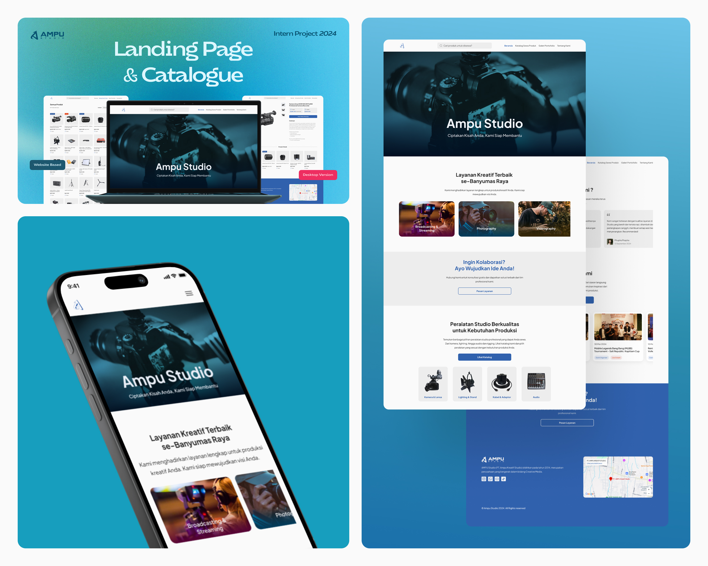
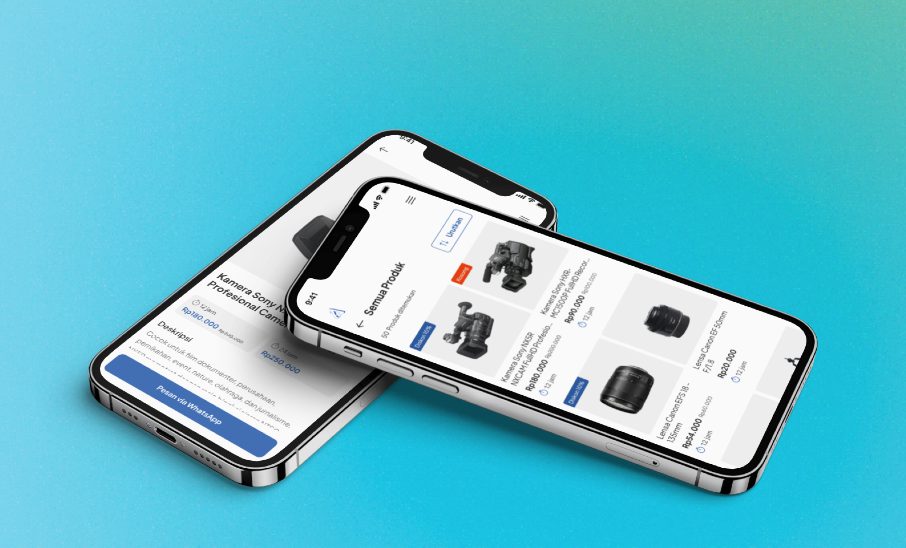
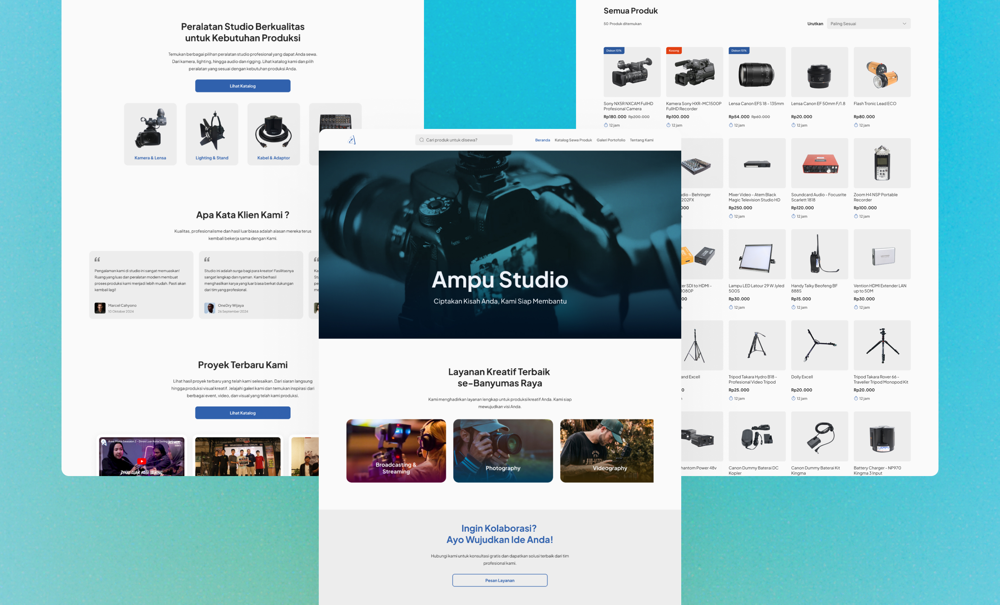

### Description
This project is the result of my internship at Ampu Studio, where I play a role in designing UI/UX for the company's website. The design I work on includes a landing page, product catalog, and portfolio page that displays Ampu Studio's works. The main focus in this design is to present a modern, professional, and accessible look, both on desktop and mobile responsive, so that users can browse content comfortably on various devices.

---

### Tools
- Figma

---

### Result

---

---
