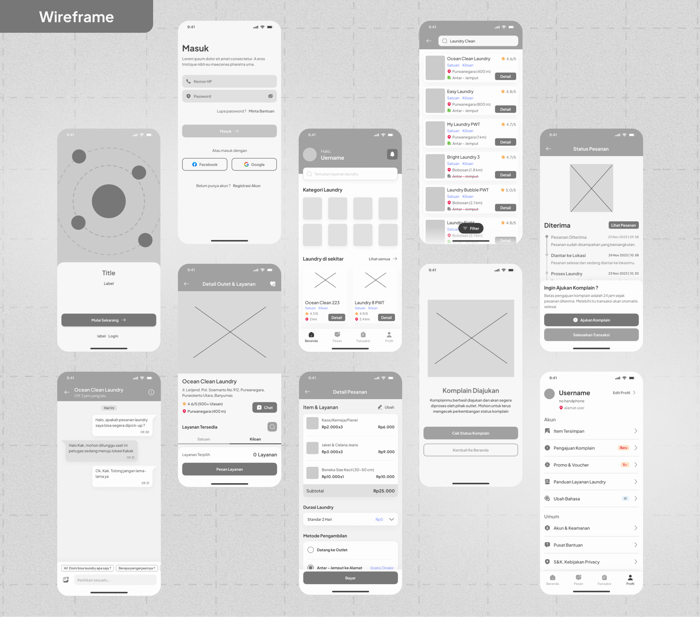
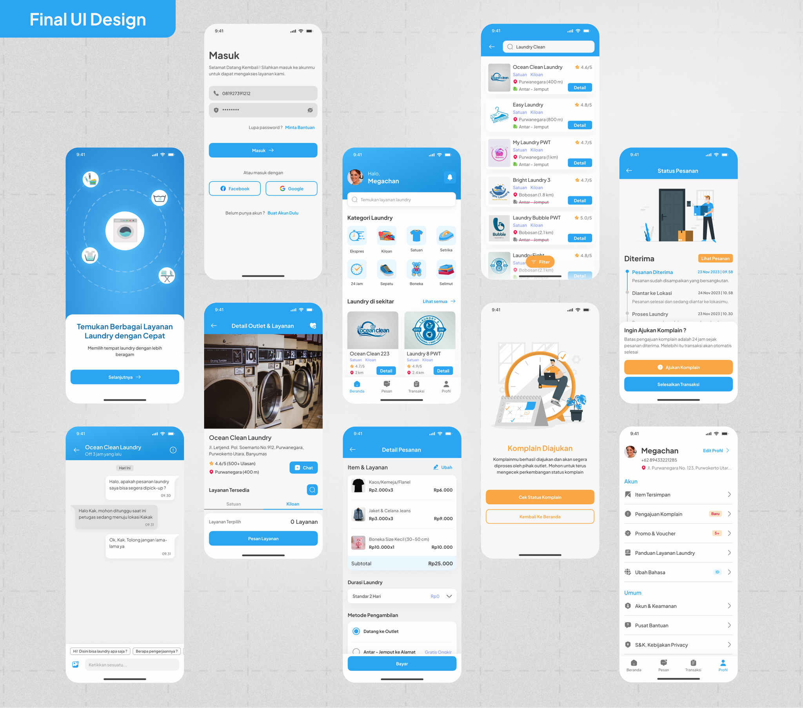

### Description
AnyWash is a laundry service application designed by my team for the UI/UX Design Competition at the Indoneris 2023 Competition. The design of this application was motivated by the user's need to get laundry services that are easy, fast, and guarantee service quality in an application. This application was designed by implementing the design thinking method.

---

### Tools
- Figma

---

### Result
<!-- Documentation Process : Behance([link](https://www.behance.net/gallery/189297017/AnyWash-Laundry-Mobile-App)) -->
|          |          |
|----------|----------|
|  |  |

---

Documentation Process : [Behance](https://www.behance.net/gallery/189297017/AnyWash-Laundry-Mobile-App)