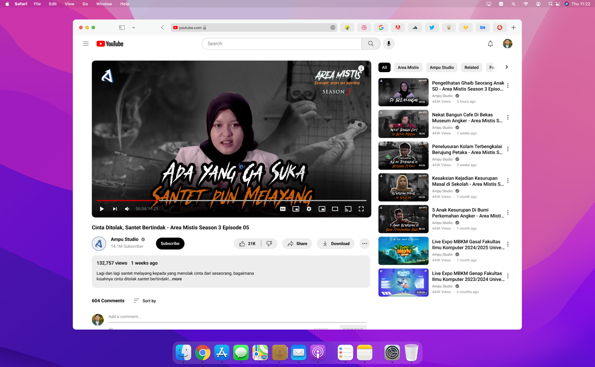

### Description
This project was completed during my internship at Ampu Studio, focusing on creating poster and thumbnail designs for one of their content segments, Podcast ‘Area Mistis’. The podcast features discussions on horror themes and mysterious stories, visually represented through eye-catching graphic designs. The poster and thumbnail designs were developed to strengthen the brand and attract audiences to follow the podcast across various digital platforms.

---

### Tools
- Adobe Photoshop

---
### Result
-  **Poster**
|          |          |
|----------|----------|
|  |  |

---

- **Thumbnail**
