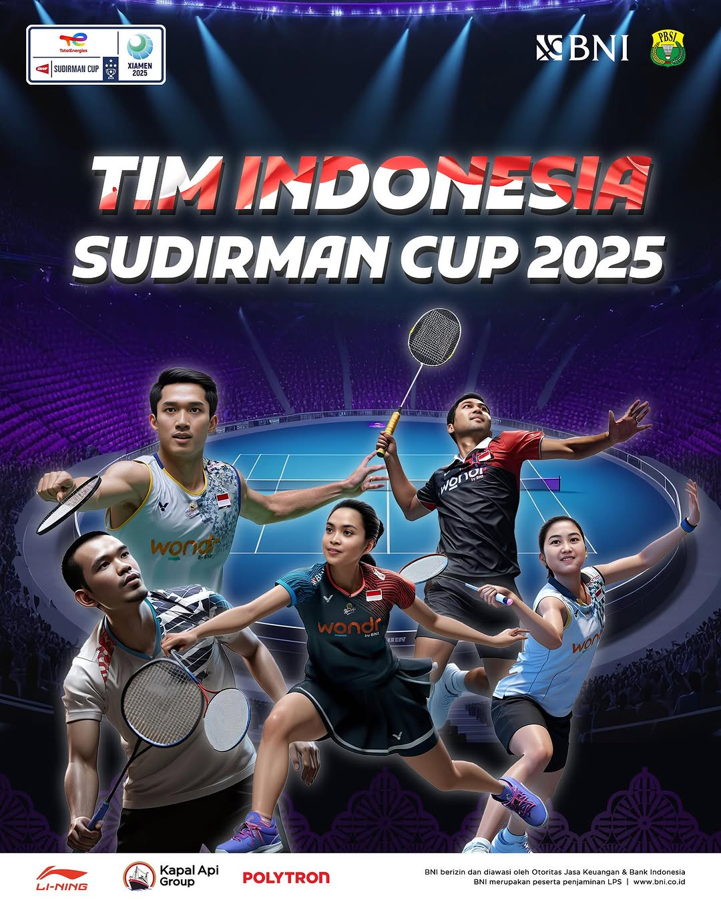

### Description
This project was motivated by concerns regarding the official PBSI poster released for the Sudirman Cup, which lacked proper design quality in terms of layout, typography, and the careless use of AI-generated assets. As a response, I created a redesigned poster ****with better composition, a sporty style, and a professional visual identity that reflects the spirit of Indonesia’s national badminton team. The aim was to highlight that original works by local designers can deliver much higher quality and pride than unrefined AI outputs..

---

### Tools
- Adobe Photoshop

---

### Result
|My Version|Official PBSI|
|----------|----------|
|  |  |