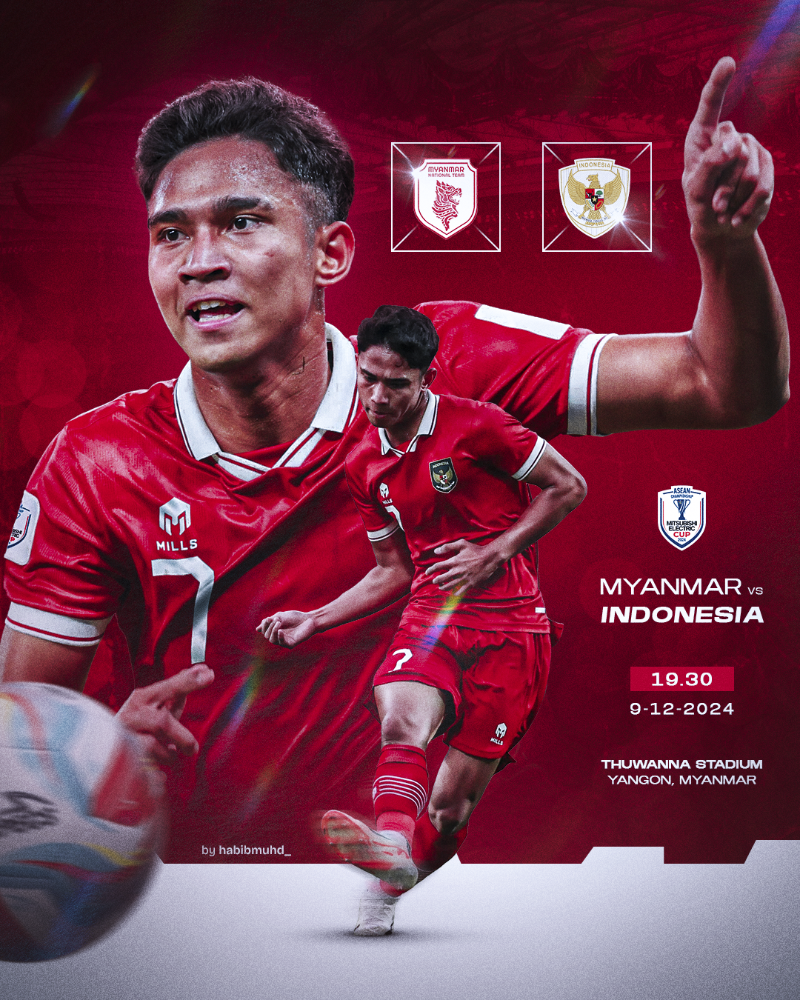
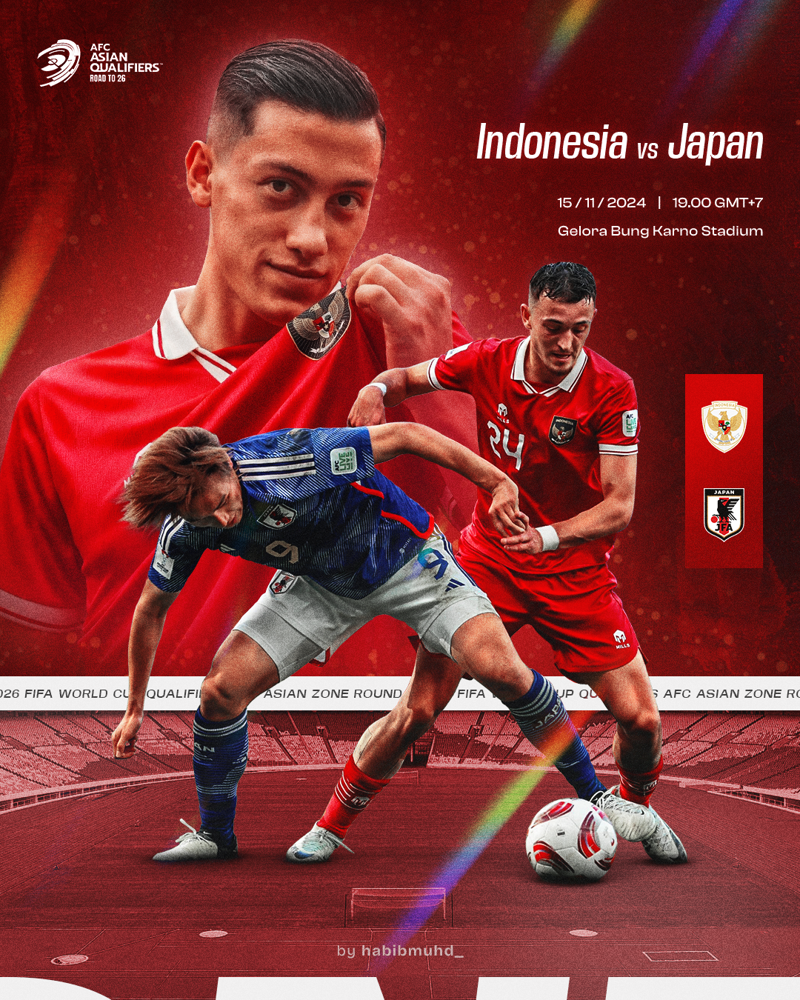
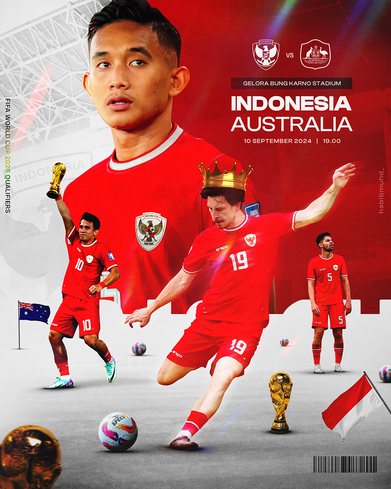
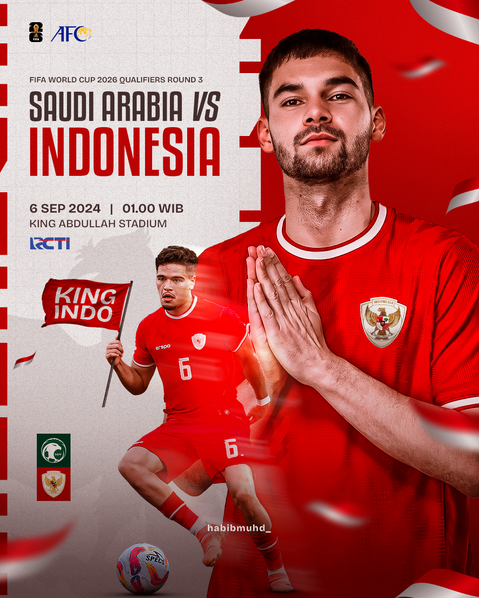

### Description
This project is a personal exploration in graphic design, where I created match posters for several soccer teams. The main objective of this project was to practice and improve my skills in sports poster design, with a focus on visual composition, typography, and photo manipulation to convey a strong sense of competition and national pride. These posters were designed with a modern visual style that emphasizes energy, dynamics, and team identity.

---

### Tools
- Adobe Photoshop

---

### Result
- #### Indonesia National Team Match
|          |          |
|----------|----------|
|  |  |
|          |          |
|----------|----------|
|  |  |